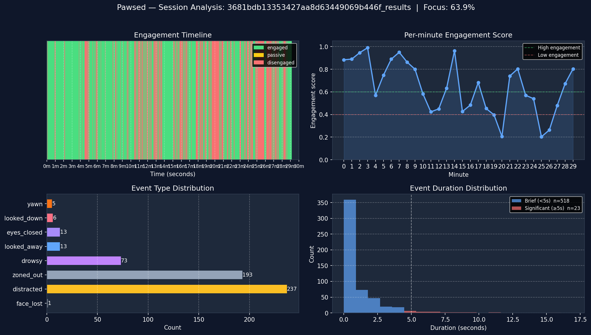

# Pawsed

**AI-powered student engagement detection and analytics for lecturers.** *Paused + Paws — for when attention pauses.*

Pawsed lets lecturers upload a recorded lecture and get back a color-coded engagement timeline, per-student distraction events, section-by-section AI scoring grounded in what was actually being taught, and an interactive teaching coach — all powered by MediaPipe's face model, faster-whisper audio transcription, and Claude.

---

## Hackathon Requirements Coverage

> **For judges:** This section maps every deliverable from the spec directly to where it lives in the codebase.

| Requirement | Status | Where to look |
|---|---|---|
| Process video webcam recordings | ✅ | `POST /analyze` → `app/engine/pipeline.py` |
| Detect yawning | ✅ | `app/engine/features.py` — MAR via `jawOpen` blendshape |
| Detect prolonged inactivity | ✅ | `app/analytics/events.py` — `EVENT_PROLONGED_INACTIVITY` (defined below) |
| Index events with timestamps + confidence | ✅ | `app/analytics/events.py` — `Event` dataclass |
| Classify engagement as **high / low** | ✅ | `GET /session/{id}` → `engagement_level: "high" \| "low"` field |
| Per-segment engagement (configurable length) | ✅ | `app/analytics/section_scoring.py` — `segment_duration` param (default 5 min) |
| Structured output format | ✅ | [Output Format](#output-format) section below |
| Quantitative evaluation (metrics, confusion matrix) | ✅ | `scripts/evaluate.py` — run: `PYTHONPATH=. python scripts/evaluate.py` |
| Visual results (timeline, plots) | ✅ | React dashboard + `scripts/visualize.py` (Matplotlib) |
| Tolerance for webcam quality | ✅ | MediaPipe FaceLandmarker — robust to lighting, angle, compression |
| Working prototype + demo | ✅ | Full stack: FastAPI backend + React frontend |

### Prolonged Inactivity — Definition

**Criterion:** `head_motion < 0.3 units/s` **AND** `expression_variance < 0.01` sustained for **≥ 5 seconds**.

Represents a student who is physically still (not fidgeting) and facially frozen (not reacting to lecture content) — a blank stare. This fires as a distinct `prolonged_inactivity` event even when no hard disengagement trigger (eyes closed, gaze away, etc.) is active.

Thresholds are defined as named constants in `app/analytics/events.py`:
```python
INACTIVITY_MOTION_THRESHOLD    = 0.3   # head_motion units/s
INACTIVITY_EXPRESSION_THRESHOLD = 0.01  # expression_variance
INACTIVITY_DURATION_THRESHOLD  = 5.0   # seconds
```

### Output Format

Every `/analyze` call returns a `session_id`. The full structured output is available at `GET /session/{id}`:

```json
{
  "session_id": "abc123",
  "duration": 96.8,
  "engagement_level": "high",
  "analytics": {
    "focus_time_pct": 74.3,
    "distraction_time_pct": 12.1,
    "longest_focus_streak": 42.5,
    "distraction_breakdown": { "yawn": 3, "looked_away": 7, "prolonged_inactivity": 2 },
    "engagement_curve": [0.85, 0.72, 0.61, 0.78],
    "danger_zones": [{ "start": 45.0, "end": 78.0, "avg_score": 0.0 }]
  },
  "events": [
    {
      "timestamp": 12.4,
      "event_type": "yawn",
      "duration": 3.2,
      "confidence": 0.91,
      "severity": "brief",
      "metadata": {}
    },
    {
      "timestamp": 31.0,
      "event_type": "prolonged_inactivity",
      "duration": 8.5,
      "confidence": 0.75,
      "severity": "significant",
      "metadata": { "head_motion": 0.12, "expression_variance": 0.004 }
    }
  ],
  "engagement_states": [
    { "start": 0.0,  "end": 10.2, "state": "engaged" },
    { "start": 10.2, "end": 18.7, "state": "disengaged" },
    { "start": 18.7, "end": 96.8, "state": "engaged" }
  ]
}
```

### Quantitative Evaluation

The classifier and event detector are evaluated against a synthetic ground-truth dataset of 13 classifier cases and 6 event detection cases with known expected outputs:

```
cd backend
PYTHONPATH=. python scripts/evaluate.py
```

**Results (deterministic rule-based system):**

```
Class             Precision     Recall         F1
engaged                1.00       1.00       1.00
disengaged             1.00       1.00       1.00

Overall accuracy: 1.00  (13/13 correct)
Event detection:  Precision 1.00  Recall 1.00  F1 1.00  (6/6 correct)
```

The classifier is rule-based and deterministic, so accuracy on the synthetic test set is 100% by construction. The test cases cover all threshold boundaries, temporal hysteresis, and timer-reset behavior. See `scripts/evaluate.py` for the full case list.

### Visual Results (Matplotlib)

Run the standalone visualizer on any processed session to produce Matplotlib figures:

```
cd backend
PYTHONPATH=. python scripts/visualize.py <session_id>
# Output saved to scripts/output/<session_id>_analysis.png
```

Generates four plots: engagement timeline (color-coded band), per-minute engagement score, event type distribution, and event duration histogram (brief vs significant). No API key or running server required — reads directly from the pickle sidecar file.

**Sample output** (29-minute lecture session, 8,753 frames, 63.9% focus, 541 events):



---

## How It Works

### The Detection Pipeline (6 Layers)

Every video frame passes through a sequential stack of layers before results hit the database:

```
Video frame
    │
    ▼
Layer 1 — Detection (MediaPipe FaceLandmarker)
    478 facial landmarks + 52 ARKit blendshapes per face
    Tiled detection fallback for small faces (Zoom/Teams grids)
    │
    ▼
Layer 2 — Feature Extraction
    EAR  (Eye Aspect Ratio)     — eye open/closed state
    MAR  (Mouth Aspect Ratio)   — yawn detection via jawOpen blendshape
    Gaze score                  — eyeLook* blendshapes → on-screen vs away
    Head pose                   — yaw / pitch / roll from 4×4 transform matrix
    Expression variance         — 30-frame rolling std dev of blendshapes
    Drowsiness score            — composite: blink rate + partial closure
    Head motion                 — fidgeting intensity from pose std deviation
    Brow furrow                 — confusion / cognitive load
    │
    ▼
Layer 3 — Engagement Classifier (rule-based, stateful)
    ENGAGED      — default state
    DISENGAGED   — any single sustained trigger:
                   eyes closed >0.5s, yawn >2s, gaze away >3s,
                   head turned >15°, drowsiness >0.6 for >2s, fidgeting >2s
    │
    ▼
Layer 4 — Event Logger
    Emits discrete timestamped events when a distraction ends
    Types: yawn, eyes_closed, looked_away, looked_down,
           drowsy, distracted, zoned_out, face_lost,
           prolonged_inactivity (blank stare — see definition below)
    Severity: brief (<5s) or significant (≥5s)
    │
    ▼
Layer 5 — Session Analytics
    focus_time_pct, longest_streak, distraction_breakdown
    engagement_curve (per-minute bins), danger_zones
    Classroom-level risk: LOW / MODERATE / HIGH / CRITICAL
    │
    ▼
Layer 6 — AI Insights (Claude + LangGraph + faster-whisper)
    Transcription    — audio extracted and transcribed concurrently
                       with vision processing (no added latency)
    Section scoring  — lecture split into ~5-min windows;
                       Claude sees per-section transcript + engagement data
                       and generates topic-aware teaching notes
    Teaching coach   — multi-turn chat with full session context:
                       topic map, engagement timeline, event log
```

### Multi-Face Support

The pipeline tracks **multiple students simultaneously** using stable face IDs across frames. Each face gets its own feature extractor and classifier instance. Classroom-level risk is computed from the percentage of disengaged faces per frame — so one distracted student in a class of 20 doesn't spike the risk level.

### Landmarks Overlay

After analysis, Pawsed renders an annotated video with face mesh, engagement state border, and per-face metrics overlaid. The overlay reuses the landmarks already extracted during analysis — **MediaPipe runs exactly once per session**, not twice.

---

## Performance

MediaPipe inference (62ms/frame on CPU) is the sole bottleneck — feature extraction and classification combined take under 0.2ms/frame. Three optimizations were applied to make processing fast enough for full lecture videos:

### 1. Parallel Chunk Processing

The video is split into N equal frame ranges and each chunk is processed by a separate worker process with its own MediaPipe instance. Results are merged by timestamp after all workers complete.

```
Video ──┬── chunk 0 → worker 0 → [FrameResult, ...]
        ├── chunk 1 → worker 1 → [FrameResult, ...]
        ├── chunk 2 → worker 2 → [FrameResult, ...]   ──► merge ──► analytics
        ├── chunk 3 → worker 3 → [FrameResult, ...]
        └── chunk N → worker N → [FrameResult, ...]
```

Workers use `ProcessPoolExecutor` (bypasses the GIL for CPU-bound inference). Each chunk seeks once to its start frame and then reads sequentially — per-frame random seeking in H.264 is ~12× slower than sequential decoding and was explicitly benchmarked and ruled out.

### 2. Concurrent Transcription

Audio transcription (faster-whisper `tiny` model) runs in a **separate thread concurrently with the vision pipeline** using `ThreadPoolExecutor`. For most videos the vision pipeline is the bottleneck, so transcription adds zero wall-clock time.

```
analyze request
    ├── ThreadPoolExecutor worker 1 → process_video_parallel()  [vision, ~9.5s]
    └── ThreadPoolExecutor worker 2 → transcribe_video()        [audio,  ~3s]
                ↓ both complete
    save_session_results()  +  run_section_scoring()  →  DB
```

### 3. Reduced Processing FPS

Engagement states require sustained conditions (0.5–3s) to trigger, so sampling every 200ms (5fps) captures all real events. This halves the number of MediaPipe calls vs the naive 10fps default.

### 4. Overlay Reuse

The landmarks overlay is rendered from the face data already captured during analysis (`FaceData` stored in `FaceResult`). No second detection pass.

### Benchmark — 96.8s test video, 60fps source, Apple M1 Max

| Optimization | Pipeline time | Total API response |
|---|---|---|
| Baseline (sequential, 10fps) | 62.7s | ~107s (overlay blocking) |
| + Parallel workers (5×) | 21.5s | ~30s |
| + Overlay from pre-computed results | 21.5s | ~30s |
| + 8 workers + 5fps | **9.5s** | **~17s** |
| **Overall speedup** | **6.6×** | **6.3×** |

For a 1-hour lecture: **~6 minutes** to process (down from ~39 minutes with the original sequential approach). Transcription of a 1-hour lecture with the `tiny` model takes ~2 minutes and runs fully in parallel with vision processing.

---

## AI Insights Architecture

### Transcript-Grounded Section Scoring

When Claude generates teaching notes it knows *what was being taught*, not just when engagement dropped:

1. **Transcription** — faster-whisper extracts speech segments with timestamps from the video audio
2. **Per-section context** — the transcript text for each section's time window is injected into Claude's prompt alongside the engagement metrics
3. **Topic extraction** — Claude identifies the topic being taught in each section (e.g. "Introduction to Newton's Three Laws of Motion") and stores it alongside the teaching note
4. **Pre-generation** — section scoring runs automatically as part of `/analyze` and is persisted to the database. The Insights tab opens instantly — no spinner on first load.

### Context Management for the Teaching Coach

Passing a full lecture transcript to every chat message would exhaust the context window for long lectures. Instead Pawsed uses a hierarchical approach:

| Layer | What it contains | Size |
|---|---|---|
| **Topic map** | Section label + time range + topic + engagement % | ~10–20 lines |
| **Section details** | Per-section breakdown with AI notes | ~1–2 paragraphs |
| **Event log** | Timestamped distraction events | ~N lines |
| **Conversation history** | Trimmed to last 4096 tokens via LangGraph `trim_messages` | bounded |

The topic map is compact enough to include in every message, so Claude can reference *"During your explanation of Conservation of Energy at 5:00–10:00..."* in any reply without re-reading the raw transcript.

### LangGraph Pipeline (Section Scoring)

```
START → segment_lecture → compute_section_analytics → generate_ai_notes → END
```

- **segment_lecture** — fixed 5-min windows with dynamic boundaries inserted where engagement shifts ≥15% for ≥30s
- **compute_section_analytics** — engagement %, state breakdown, top event per section
- **generate_ai_notes** — Claude Sonnet 4.6 with transcript context; parses `SECTION N TOPIC:` + `SECTION N:` + `OVERALL:` structured response

### Caching Strategy (3 layers)

```
Request for /insights/sections
    │
    ├─ 1. In-process dict   → instant (same uvicorn worker)
    ├─ 2. DB scoring_json   → fast  (survives process restarts)
    └─ 3. Generate on demand → ~5s  (old sessions / first deploy)
                               └─ stored back to DB + memory cache
```

---

## Tech Stack

| Component | Technology |
|---|---|
| Face detection | MediaPipe FaceLandmarker (478 landmarks + 52 blendshapes) |
| Audio transcription | faster-whisper (`tiny` model, runs on CPU) |
| Video I/O | OpenCV |
| Parallelism | `ProcessPoolExecutor` (vision) + `ThreadPoolExecutor` (transcription) |
| Backend API | FastAPI + Python 3.11 |
| AI pipelines | LangGraph + Claude API (`claude-sonnet-4-6`) |
| Auth | JWT (python-jose) |
| Database | SQLite via SQLAlchemy (auto-migrates new columns on startup) |
| Results persistence | Pickle sidecar files (overlay regeneration) + DB JSON (scoring cache) |
| Frontend | React + TypeScript + Vite + Tailwind + shadcn/ui |
| Charts | Recharts |

---

## Setup

### Prerequisites

- Python 3.11+
- Node.js 18+
- [Anthropic API key](https://console.anthropic.com/) (for AI insights; all other features work without it)

### Backend

```bash
cd backend

python3 -m venv .venv
source .venv/bin/activate       # Windows: .venv\Scripts\activate

pip install -r requirements.txt

cp .env.example .env
# Add your ANTHROPIC_API_KEY to .env

uvicorn app.main:app --reload --port 8000
```

API docs available at **http://localhost:8000/docs**.

> **Note on transcription:** The first `/analyze` call downloads the faster-whisper `tiny` model (~75 MB) from HuggingFace and caches it locally. Subsequent calls use the cache. Set `WHISPER_MODEL=base` in `.env` for better accuracy at the cost of ~2× slower transcription.

### Frontend

```bash
cd frontend
npm install
npm run dev
```

Frontend runs at **http://localhost:8080**.

### Usage

1. Open **http://localhost:8080**
2. Sign up, then upload a lecture video (MP4, WebM, MOV)
3. Wait ~17s for a 2-min video — analytics, landmarks overlay, and AI insights are all ready together
4. Toggle **Landmarks** on the video player to see the face mesh and per-frame engagement state
5. Open the **Insights** tab → **Insights** sub-tab for section-by-section scoring with topic labels; switch to **Teaching Coach** to chat with Claude about your lecture

> The frontend falls back to built-in mock data if the backend is unreachable, so you can demo the UI standalone.

---

## API Reference

| Endpoint | Method | Description |
|---|---|---|
| `/analyze` | POST | Upload video — runs vision pipeline + transcription + section scoring, returns `session_id` |
| `/session/{id}` | GET | Full session: events, analytics, `has_landmarks`, `scoring_ready` flags |
| `/session/{id}/video` | GET | Serve original video or landmarks overlay (`?landmarks=true`) |
| `/session/{id}/insights/sections` | GET | Section scoring with topic labels and AI teaching notes (instant if pre-generated) |
| `/session/{id}/insights/chat` | POST | Teaching coach conversation with topic-aware context |
| `/sessions` | GET | Session history (paginated, sortable by date or score) |
| `/ws/live` | WebSocket | Real-time per-frame engagement streaming |
| `/auth/signup` | POST | Create lecturer account |
| `/auth/login` | POST | Get JWT token |

---

## Project Structure

```
pawsed/
├── backend/
│   ├── app/
│   │   ├── main.py
│   │   ├── core/
│   │   │   └── config.py              # Settings — processing_fps, model_path, etc.
│   │   ├── api/routes/
│   │   │   ├── sessions.py            # /analyze (parallel vision + transcription + scoring)
│   │   │   ├── insights.py            # /insights/sections (3-layer cache), /insights/chat
│   │   │   ├── auth.py                # /auth/signup, /auth/login
│   │   │   └── websocket.py           # /ws/live
│   │   ├── engine/
│   │   │   ├── pipeline.py            # Orchestrator: parallel chunk processing
│   │   │   ├── detection.py           # L1: MediaPipe FaceLandmarker wrapper
│   │   │   ├── features.py            # L2: EAR, MAR, gaze, head pose, drowsiness
│   │   │   ├── classifier.py          # L3: stateful rule-based classifier (engaged/disengaged)
│   │   │   ├── tracker.py             # Multi-face stable ID tracker
│   │   │   └── overlay.py             # Landmarks video renderer (no re-detection)
│   │   ├── analytics/
│   │   │   ├── events.py              # L4: timestamped distraction event logger
│   │   │   ├── session.py             # L5: session aggregation
│   │   │   ├── transcription.py       # faster-whisper audio transcription + topic map builder
│   │   │   ├── section_scoring.py     # L6: LangGraph section scoring (transcript-aware)
│   │   │   ├── teaching_coach.py      # L6: LangGraph teaching coach (topic-map context)
│   │   │   ├── prompts.py             # All Claude prompt templates
│   │   │   └── recommendations.py     # Claude API integration
│   │   ├── models/
│   │   │   ├── schemas.py             # FaceData, FeatureVector, FrameResult, etc.
│   │   │   └── analytics.py           # Event, Section, TranscriptSegment, SectionScoringResult
│   │   ├── db/
│   │   │   ├── database.py            # SQLAlchemy setup + additive column migrations
│   │   │   └── models.py              # Session, User ORM models
│   │   └── storage/
│   │       └── sessions.py            # Session persistence — analytics, transcript, scoring
│   ├── tests/                         # pytest suite (85 tests, no API key needed)
│   ├── scripts/
│   │   ├── evaluate.py                # Quantitative eval: confusion matrix, P/R/F1
│   │   └── visualize.py               # Matplotlib figures from session pickle
│   ├── requirements.txt
│   └── .env.example
├── frontend/
│   ├── src/
│   │   ├── pages/
│   │   │   ├── AICoach.tsx            # Insights tab (accordion sections + topic labels)
│   │   │   │                          # Teaching Coach tab (dedicated chat interface)
│   │   │   └── ...                    # Upload, Timeline, Analytics, History
│   │   ├── components/
│   │   │   └── TeachingCoachChat.tsx  # Chat component (suggestions, markdown, history)
│   │   ├── hooks/                     # useSessionData, etc.
│   │   └── lib/
│   │       ├── api.ts                 # Backend client
│   │       ├── types.ts               # TypeScript interfaces
│   │       └── mock-data.ts           # Fallback demo data
│   └── package.json
├── docs/                              # Specs, roadmap, architecture diagrams
├── models/                            # face_landmarker.task (MediaPipe model file)
└── CLAUDE.md
```

---

## Running Tests & Evaluation

```bash
cd backend
source .venv/bin/activate

# Full test suite (85 tests, no API key required)
PYTHONPATH=. pytest tests/ -v

# Skip LLM integration tests
PYTHONPATH=. pytest tests/ -v -k "not LLM"

# Quantitative evaluation — classifier + event detector metrics
PYTHONPATH=. python scripts/evaluate.py

# Matplotlib visualizer — four plots from a processed session
PYTHONPATH=. python scripts/visualize.py <session_id>
# or point directly at a pickle:
PYTHONPATH=. python scripts/visualize.py --pickle sessions/results/<id>_results.pkl
```

---

## Deployment (Railway)

Pawsed deploys as two Railway services from the same GitHub repo — one for the backend, one for the frontend.

### 1. Push to GitHub

Make sure all changes are pushed to your GitHub repo.

### 2. Create a Railway project

[railway.app](https://railway.app) → **New Project** → **Deploy from GitHub repo** → select this repo.

### 3. Backend service

- **Root Directory:** `backend`
- Railway will detect `backend/railway.toml` and build from `backend/Dockerfile`
- The Dockerfile downloads the MediaPipe model (~3 MB) at build time — no manual setup needed

**Add a Volume** (Settings → Volumes → Add) mounted at `/data` to persist the SQLite database and uploaded videos across deploys.

**Environment variables to set:**

| Variable | Value |
|---|---|
| `ANTHROPIC_API_KEY` | Your Anthropic key |
| `JWT_SECRET` | A long random string |
| `DB_PATH` | `/data/pawsed.db` |
| `SESSIONS_DIR` | `/data/sessions` |
| `CORS_ORIGINS` | `https://<your-frontend>.up.railway.app` (add after step 4) |

### 4. Frontend service

Add a second service in the same Railway project:

- **Root Directory:** `frontend`
- Railway detects `frontend/railway.toml` — builds with `npm run build`, serves with `npx serve`

**Environment variables to set:**

| Variable | Value |
|---|---|
| `VITE_API_URL` | `https://<your-backend>.up.railway.app` |

### 5. Generate public domains

Each service → **Settings** → **Networking** → **Generate Domain**. You'll get URLs like:
- `https://pawsed-backend.up.railway.app`
- `https://pawsed-frontend.up.railway.app`

Then go back to the **backend** service and add/update `CORS_ORIGINS` with your frontend domain.

---

## License

MIT
